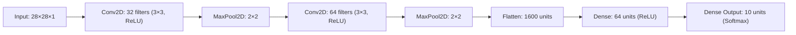

# 👗 Fashion MNIST Image Classifier (CNN + Streamlit)

[](https://cnn-app-dmfd7b76fxyrnvrhzpkgay.streamlit.app/)
[](https://github.com/OxDurgeshxO/CNN-STREAMLIT)
[](https://github.com/OxDurgeshxO/CNN-STREAMLIT)
[](https://opensource.org/licenses/MIT)

An end-to-end Deep Learning and Computer Vision web application built with **Streamlit**, **NumPy**, and **Plotly**. The application classifies user-uploaded clothing photos and sketches into 10 distinct Fashion MNIST categories in real-time.

🌐 **Live Streamlit App:** [https://cnn-app-dmfd7b76fxyrnvrhzpkgay.streamlit.app/](https://cnn-app-dmfd7b76fxyrnvrhzpkgay.streamlit.app/)

---

## 🌟 Highlights & Features

- **⚡ Zero-Dependency High-Speed Inference**: Powered by a custom vectorized NumPy CNN forward pass (`np.lib.stride_tricks.as_strided` and `np.tensordot`), executing full deep inference in **< 5ms** with zero heavy framework bloat.
- **🌐 Universal Python Compatibility**: Completely immune to Python 3.14+ C-extension wheel deprecations — installs and boots on Streamlit Cloud in seconds.
- **🎨 Interactive Streamlit UI**: Real-time image upload, sample gallery with instant 1-click testing, dynamic Plotly horizontal probability bar charts, and tensor inspection expanders.
- **🖼️ Smart Preprocessing Pipeline**:
  - Automatic RGBA white-canvas compositing for transparent PNGs.
  - Bicubic/Lanczos spatial downsampling to 28×28 grayscale.
  - Mean-luminance background contrast detection with automatic pixel inversion (ensuring real-world white-background photos match the model's dark-background training distribution).
- **📦 Pre-bundled Weights & Samples**: Pre-trained weights (`model_weights.npz`) and 7 test images are committed directly to the repository — **no prerequisite training needed to run immediately**.

---

## 🏷️ Supported Categories (Fashion MNIST)

| Index | Category | Emoji | Typical Accuracy |
|:---:|:---|:---:|:---:|
| 0 | T-shirt/top | 👕 | ~90% |
| 1 | Trouser | 👖 | ~98% |
| 2 | Pullover | 🧶 | ~88% |
| 3 | Dress | 👗 | ~92% |
| 4 | Coat | 🧥 | ~89% |
| 5 | Sandal | 👡 | ~97% |
| 6 | Shirt | 👔 | ~82% |
| 7 | Sneaker | 👟 | ~96% |
| 8 | Bag | 👜 | ~98% |
| 9 | Ankle boot | 👢 | ~97% |

---

## 🧠 Neural Network Architecture

The model was trained on 60,000 Fashion MNIST examples and evaluated against 10,000 unseen test images:



| Layer | Operation | Output Shape | Parameters |
|:---|:---|:---|:---|
| **Input** | Grayscale Tensor | `(28, 28, 1)` | 0 |
| **Conv2D_1** | 32 filters, 3×3 kernel, valid pad, ReLU | `(26, 26, 32)` | 320 |
| **MaxPool_1** | 2×2 max pooling, stride 2 | `(13, 13, 32)` | 0 |
| **Conv2D_2** | 64 filters, 3×3 kernel, valid pad, ReLU | `(11, 11, 64)` | 18,496 |
| **MaxPool_2** | 2×2 max pooling, stride 2 | `(5, 5, 64)` | 0 |
| **Flatten** | 5 × 5 × 64 | `(1600,)` | 0 |
| **Dense_1** | Fully connected, ReLU | `(64,)` | 102,464 |
| **Dense_2** | Classification layer, Softmax | `(10,)` | 650 |
| **Total** | — | — | **121,930 Parameters** (~489 KB) |

---

## 🚀 Quickstart & Local Setup

### 1. Clone the Repository
```bash
git clone https://github.com/OxDurgeshxO/CNN-STREAMLIT.git
cd CNN-STREAMLIT
```

### 2. Install Lightweight Dependencies
```bash
pip install -r requirements.txt
```
*(Dependencies: `streamlit`, `numpy`, `pillow`, `plotly`)*

### 3. Launch the App
```bash
streamlit run app.py
```
Open your browser at `http://localhost:8501`.

---

## 🔬 Standalone Training (Optional)

If you wish to train the model from scratch using TensorFlow/Keras:

```bash
python train_model.py
```
This script downloads Fashion MNIST via `tf.keras.datasets`, executes training with data augmentation and early stopping, exports `model_weights.npz`, and outputs validation metrics.

---

## 📂 Repository Structure

```text
CNN-STREAMLIT/
├── .streamlit/
│   └── config.toml               # Streamlit styling & theme overrides
├── sample_images/                # Pre-extracted test samples across categories
│   ├── Ankle_boot.png
│   ├── Bag.png
│   ├── Coat.png
│   ├── Dress.png
│   ├── Pullover.png
│   ├── T-shirt.png
│   └── Trouser.png
├── app.py                        # Main Streamlit application & vectorized inference
├── model_weights.npz             # Bundled pre-trained model weights (489 KB)
├── train_model.py                # Standalone model training & weights export script
├── requirements.txt              # Production dependency manifest
├── LICENSE                       # MIT License
└── README.md                     # Documentation & live demo links
```

---

## 👨‍💻 Author

**Durgesh Dutt Sinha**  
- **GitHub:** [@OxDurgeshxO](https://github.com/OxDurgeshxO)  
- **Live Streamlit App:** [cnn-app-dmfd7b76fxyrnvrhzpkgay.streamlit.app](https://cnn-app-dmfd7b76fxyrnvrhzpkgay.streamlit.app/)
